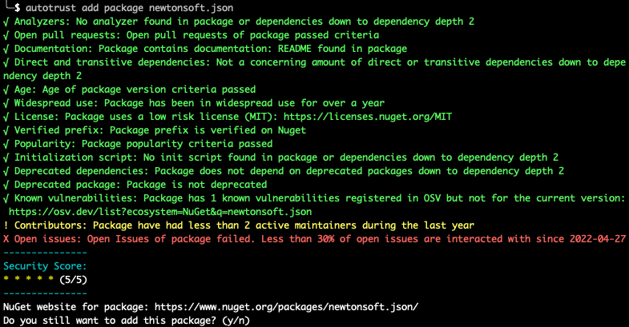
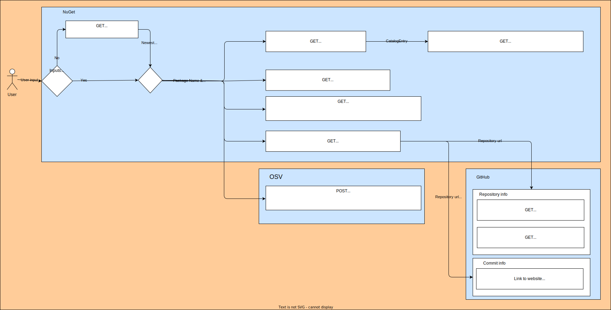

# AutoTrust

<p align="center">
  
</p>

## **Auto**matic software dependency auditing using **trust** criteria

AutoTrust is a Command Line Interface (CLI) tool for C# that fetches metadata about a NuGet package to help developers assess the package before installing it.

<p align="center">
  
</p>

## Getting Started

These instructions will get you a copy of the project up and running on your local machine.

## Prerequisites

- .NET 7.0 or higher

## Installing

```PowerShell
git clone https://github.com/HallvardMM/AutoTrust.git
cd AutoTrust/AutoTrust
dotnet pack
```

### Windows

```PowerShell
dotnet tool install --global --add-source ./nupkg AutoTrust
```

### Mac or Linux

```Bash
dotnet tool install --tool-path ~/bin --add-source ./nupkg AutoTrust
```

## Uninstalling

### Windows

```PowerShell
dotnet tool uninstall --global AutoTrust
```

### Mac or Linux

```Bash
dotnet tool uninstall --tool-path ~/bin AutoTrust
```

## Adding Github API

The Github API has a rate limit that can lead to unsuccessful API calls.
You can increase the limit by creating and adding a Github token.
We recommend using [fine grained personal access token](https://docs.github.com/en/authentication/keeping-your-account-and-data-secure/creating-a-personal-access-token#creating-a-fine-grained-personal-access-token) with permission for "Public Repositories (read-only)".

### Windows

The application looks for GITHUB_API_TOKEN in the environment variables.
Examples below on how to add environment variable (insert your token instead of "github_pat_tokenString").

Temporary in current shell:

```PowerShell
set GITHUB_API_TOKEN github_pat_tokenString
```

Permanent user environment variable:

```PowerShell
setx GITHUB_API_TOKEN github_pat_tokenString
```

### Mac or Linux

For MacOS or Linux and it will try to fetch from environment variables defined in the shell.
Example on how to add temporary (insert your token instead of "github_pat_tokenString"):

```bash
export GITHUB_API_TOKEN=github_pat_tokenString
```

#### Permanent set zsh and bash token storage

How to permanantly store the `GITHUB_API_TOKEN` will depend on which shell you use. If you use zsh (mac standard) store it in `.zshenv` and for bash (standard for most linux distributions) store it in `.bashrc`. To open the file `.zshenv` in the terminal run `$ vim ~/.zshenv` or to open in text editor run `$ touch ~/.zshenv; open ~/.zshenv`.

For both `.zshenv` and `.bashrc` add the following to the file:

```bash
export GITHUB_API_TOKEN=github_pat_tokenString
```

Note that you have to restart the terminal after adding the token for it to be available.

## Usage

### Add/Update packages with AutoTrust:

```PowerShell
autotrust add [<PROJECT>] package <PACKAGE_NAME> [options]
```

### Specific AutoTrust options:

Information about AutoTrust:

```PowerShell
autotrust add package -?, -h, --help
autotrust add package [PackageName] -?, -h, --help
```

More detailed output for AutoTrust:

```PowerShell
autotrust add package [PackageName] -ve, --verbosity <d|detailed|diag|diagnostic|n|normal|>
```

## Wrapping dotnet

`autotrust` is used prior to installing a dotnet package. It can be embed in your daily `dotnet` usage so you do not need to remember to run `autotrust` explicitly.

### For Windows PowerShell:

Run as administrator:

```PowerShell
Set-ExecutionPolicy -ExecutionPolicy RemoteSigned -Scope LocalMachine
```

Find profile file:

```PowerShell
echo $profile
```

Create or update profile file with command:

```PowerShell
New-Alias -Name dotnet -Value autotrust
```

Unblock file:

```PowerShell
Unblock-File -Path .\PathToProfileFile
```

Restart PowerShell.

### For Linux/Mac

```bash
alias dotnet='autotrust'
```

## Trust Criteria

AutoTrust checks dependencies, two steps down (direct and first-level transitive) for the relevant trust criteria, described as dependencies in the table.

| Trust Criteria Name                | Description of Threshold                                                                                                                                                                                                                                     | Notes                                                                                                                                                                                                   | Importance (1-10) |
| ---------------------------------- | ------------------------------------------------------------------------------------------------------------------------------------------------------------------------------------------------------------------------------------------------------------ | ------------------------------------------------------------------------------------------------------------------------------------------------------------------------------------------------------- | ----------------- |
| Age                                | Fails if the package version is less than 3 weeks old or over 1 year old old                                                                                                                                                                                 |                                                                                                                                                                                                         | 6                 |
| Analyzers                          | Fails if the package or its dependencies contain analyzers analyzers                                                                                                                                                                                         |                                                                                                                                                                                                         | 3                 |
| Contributors                       | Fails if the number of total contributors is less than 2 or there are 0 active maintainers. Warns if there is 1 active maintainer                                                                                                                            | An active maintainer is defined as a maintainer that has 3 or more commits either during the last year or of the 100 last commits                                                                       | 3                 |
| Deprecated Package                 | Fails if the package is marked as deprecated by NuGet                                                                                                                                                                                                        |                                                                                                                                                                                                         | 10                |
| Deprecated Dependencies            | Fails if any of the dependencies are marked as deprecated by NuGet                                                                                                                                                                                           |                                                                                                                                                                                                         | 10                |
| Direct and Transitive Dependencies | Warns if there are more than 20 direct dependencies or more than 50 transitive dependencies                                                                                                                                                                  | Direct dependencies are the dependencies that are directly used by the package while transitive are the dependencies of the direct dependencies, and all dependencies further below                     | 5                 |
| Documentation                      | Checks for a README in NuGet and GitHub. If none of those are present it checks for a project URL on NuGet, or a wiki or homepage on GitHub. It fails if none of the above is found                                                                          | It also checks if the size of the README is larger than 300 bytes (more than just a title).                                                                                                             | 5                 |
| Initialization Script              | Fails if the package or its dependencies contain initialization scripts                                                                                                                                                                                      |                                                                                                                                                                                                         | 8                 |
| Known Vulnerabilities              | Fails if any reported vulnerabilities are found on NuGet or in the OSV database.                                                                                                                                                                             | If a vulnerability is found, but not for the version being used in the project, the criteria will pass but inform about the vulnerability                                                               | 10                |
| License                            | Fails if no license is found or the license is considered high risk. Warns if the license is considered medium risk, or AutoTrust cannot evaluate if it is a standard license                                                                                | The licenses are automatically checked if an [SPDX](https://spdx.org/licenses/) is used. The ranking is based on [Synopsys](https://www.synopsys.com/blogs/software-security/top-open-source-licenses/) | 7                 |
| Open Issues                        | Fails if there are no open issues, or the number of open issues is more than 60% of the total number, or if less than 30% of the open issues have been updated over the last year. Warns if the total amount of issues is less than 30.                      |                                                                                                                                                                                                         | 3                 |
| Open Pull Requests                 | Fails if there are no open pull requests, or the number of open pull requests is more than 60% of the total number, or if less than 30% of the open pull requests have been updated over the last year. Warns if the total amount of pull requests is less than 10. |                                                                                                                                                                                                         | 3                 |
| Popularity                         | Fails if the number of downloads is less than 10000, or GitHub stars are less than 2, or forks or watchers are less than 1. Warns if less than 10 NuGet packages or GitHub repositories are using the package.                                               |                                                                                                                                                                                                         | 7                 |
| Verified Prefix                    | Checks if the Prefix is [reserved](https://learn.microsoft.com/en-us/nuget/nuget-org/id-prefix-reservation) on NuGet                                                                                                                                         |                                                                                                                                                                                                         | 7                 |
| Widespread Use                     | Fails if the oldest version of the package is less than 1 year old. Fails if 10 previous versions, or less if less than 10 exist, have a combined download of less than 100000. Warns if there are less than 10 prior versions.                              |                                                                                                                                                                                                         | 6                 |

### Total score

The total security score (stars) is calculated based on the importance of the trust criteria and their status (Pass/Warning/Fail). The score for each of the trust criteria is the importance multiplied by either 0, 0.5, or 1 (Pass=1, Warning=0.5, Fail=0). To get the total score we add all the individual scores and divide that by the total possible score.

## Contributing

Please see the [CONTRIBUTING](CONTRIBUTING) for guidelines on contributing to this project.

## License

This project is licensed under the Apache License - see the [LICENSE](LICENSE) file for details.

<!-- ## API Flow

The flow of where the data is fetch is shown below.

 -->
